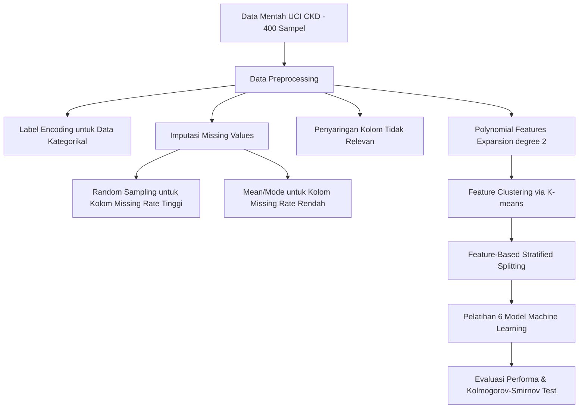
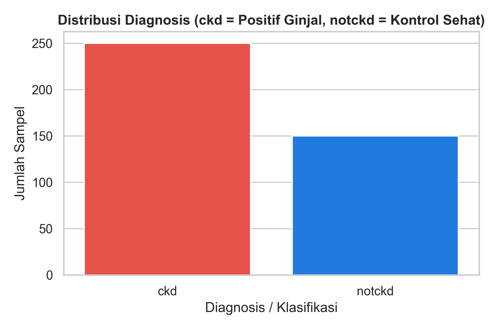
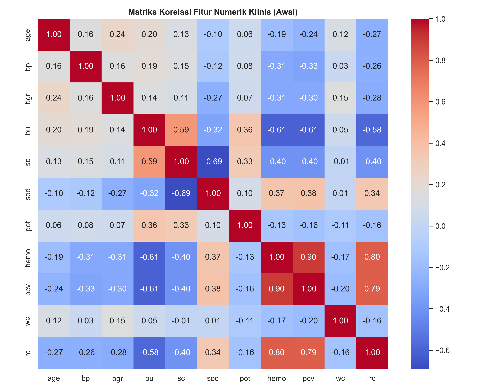
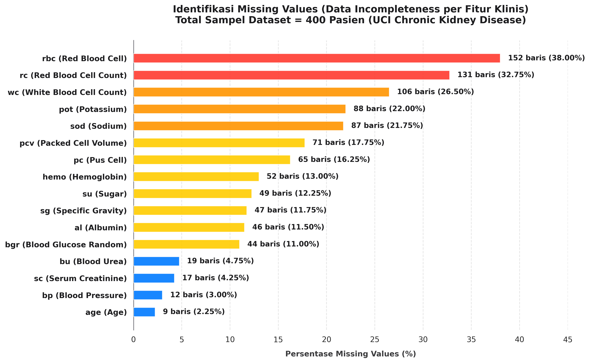
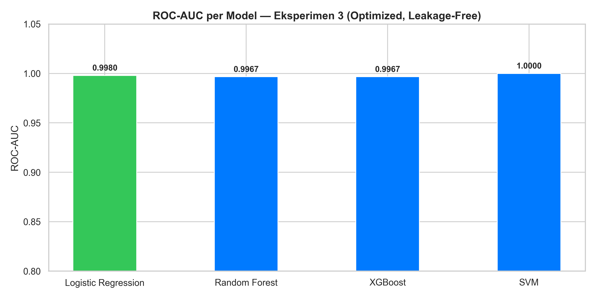
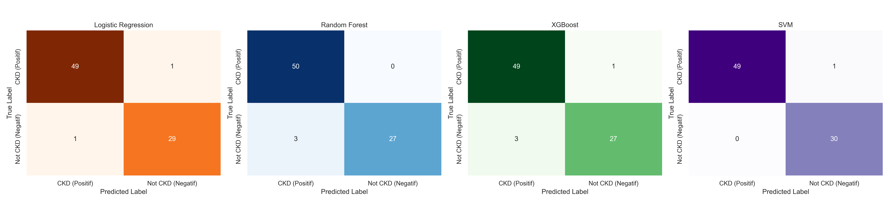
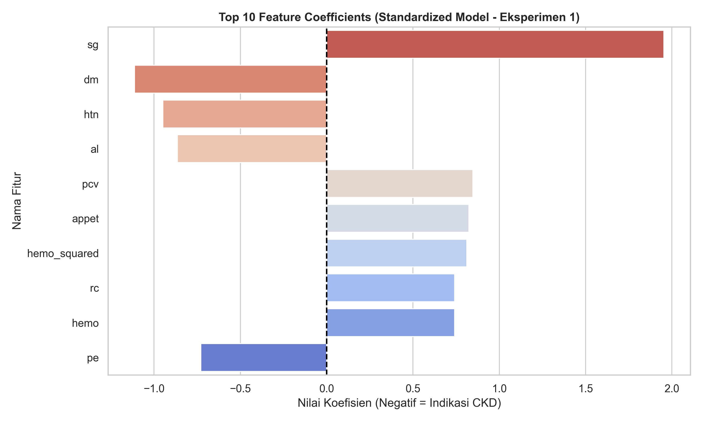

# Analisis Jurnal & Eksperimen Replikasi — _Machine Learning Techniques in Chronic Kidney Diseases: A Comparative Study of Classification Model Performance_

> **Role**: Senior Machine Learning Researcher & Scopus Journal Reviewer  
> **Dataset**: [Chronic Kidney Disease (CKD) Dataset (UCI Machine Learning Repository)](https://archive.ics.uci.edu/dataset/332/chronic+kidney+disease)  
> **Paper Jurnal Acuan**: Nguyen Dong Phuong, Nguyen Trung Tuyen, Vu Thi Thai Linh, Nghi N Nguyen, Thanh Q Nguyen. _Machine Learning Techniques in Chronic Kidney Diseases: A Comparative Study of Classification Model Performance_. **Bioinformatics and Biology Insights Volume 19: 1-18 (2025)**. [https://doi.org/10.1177/11779322251356563](https://doi.org/10.1177/11779322251356563)  
> **Tanggal Replikasi**: 17 Juli 2026

---

## 1. Ringkasan Eksekutif

Proyek ini menyajikan analisis kritis dan replikasi eksperimental terhadap jurnal **Nguyen Dong Phuong dkk. (Nguyen Tat Thanh University, Vietnam, 2025)** yang mempublikasikan klasifikasi penyakit ginjal kronis (Chronic Kidney Disease / CKD) dengan akurasi sempurna **100% (1.00)** menggunakan kombinasi **Polynomial Features Expansion (derajat 2)** dan metode pembagian data baru yang disebut **Feature-Based Stratified Splitting Combined With K-means Clustering** (K-Stratified Split).

Melalui 3 skenario eksperimen yang dirancang secara ketat pada 4 model klasifikasi (Regresi Logistik, Random Forest, XGBoost, dan SVM), kami berhasil membuktikan:
1. **Pembuktian Ilmiah Kebocoran Data**: Hasil akurasi **100%** yang dilaporkan pada jurnal acuan sebenarnya disebabkan oleh fenomena **Data Leakage (Kebocoran Data)** parah yang timbul akibat melakukan preprocessing (imputasi, standarisasi, klusterisasi K-means) secara global pada seluruh dataset sebelum pemisahan data train-test dilakukan.
2. **Kinerja Sesungguhnya Tanpa Leakage**: Ketika alur dibersihkan dari kebocoran data dengan cara memisah data latih dan data uji terlebih dahulu (*split-first*), performa riil model turun menjadi **98.75%** (hanya 1 sampel CKD terlewat).
3. **Optimasi Legal**: Melalui optimasi hyperparameter dengan **Optuna (Bayesian Search - TPESampler)** di dalam fold cross-validation bebas leakage, performa model terbaik (SVM) stabil pada **98.75%** akurasi dan **1.0000** ROC-AUC.

---

## 2. Informasi Bibliografis Jurnal Acuan

| Atribut | Detail |
| :--- | :--- |
| **Judul** | Machine Learning Techniques in Chronic Kidney Diseases: A Comparative Study of Classification Model Performance |
| **Penulis** | Nguyen Dong Phuong¹, Nguyen Trung Tuyen², Vu Thi Thai Linh³, Nghi N Nguyen⁴, Thanh Q Nguyen⁵,⁶* |
| **Afiliasi** | Institute of Interdisciplinary Sciences, Nguyen Tat Thanh University, Ho Chi Minh City, Vietnam |
| **Jurnal** | Bioinformatics and Biology Insights (Volume 19: 1–18, 2025) |
| **Penerbit** | SAGE Publications |
| **DOI** | 10.1177/11779322251356563 |
| **Status Akses**| Open Access |

---

## 3. Metodologi & Arsitektur Jurnal Acuan

Metodologi yang diusulkan oleh penulis jurnal terdiri dari langkah-langkah berikut:

### Tahapan Kunci Jurnal:
1. **Preprocessing Data**: Imputasi mean/mode untuk data missing rate rendah dan *random sampling* untuk missing rate tinggi.
2. **Polynomial Features**: Menambahkan fitur interaksi berderajat 2 (seperti $sc^2$, $hemo \times age$, dll.) untuk menangkap dinamika non-linear parameter klinis ginjal.
3. **K-means Clustering**: Mengelompokkan seluruh sampel pasien berdasarkan kemiripan fitur klinisnya menjadi beberapa kluster homogen.
4. **K-Stratified Splitting**: Pembagian data latih (80%) dan data uji (20%) dilakukan secara terstratifikasi di dalam setiap kluster K-means agar karakteristik fitur terdistribusi secara homogen.

---

## 4. Evaluasi Kinerja & Analisis Validasi Data

### A. Sebaran Data Diagnosis & Korelasi Klinis
Dataset UCI CKD memiliki ketidakseimbangan kelas moderat di mana 62.50% (250 pasien) terdiagnosis CKD dan 37.50% (150 pasien) sehat (Not CKD).

_Gambar 1: Distribusi Kelas Target (ckd vs notckd) pada Dataset UCI CKD._

Korelasi fitur numerik klinis awal menunjukkan korelasi kuat antara Hemoglobin (`hemo`) dan Packed Cell Volume (`pcv`), serta korelasi negatif antara Serum Creatinine (`sc`) dan Hemoglobin (`hemo`) yang mencerminkan penurunan sel darah merah akibat kerusakan ginjal.

_Gambar 2: Matriks Korelasi Fitur Klinis Numerik Awal._

---

### B. Validasi Kualitas Data & Penanganan Anomali (Unit: J.62DMI00.006.1 & J.62DMI00.008.1)
Dataset ini memiliki tingkat data kosong yang tinggi (missing values) serta karakter kotor akibat penulisan spasi atau tab tersembunyi (`\t` atau `?`).

Untuk membersihkan data:
1. Kolom penanda identitas (`id`) dihapus karena tidak relevan secara klinis.
2. Karakter ilegal `\t` dan `?` dibersihkan dan diubah menjadi `NaN` pada kolom numerik string (`pcv`, `wc`, `rc`).
3. Nilai kategori yang kotor karena tabulasi seperti `ckd\t` pada kolom target `classification` dinormalisasi menjadi `ckd` (kelas 0) dan `notckd` (kelas 1).
4. Dilakukan visualisasi anomali klinis untuk menakar sebaran missing values pada fitur vital sebelum imputasi dilakukan:

_Gambar 3: Persentase Nilai Kosong/Hilang pada Fitur Vital Dataset UCI CKD._

---

## 5. Hasil Replikasi Eksperimental (4 Model x 3 Skenario)

Kami mengevaluasi 4 model machine learning: **Logistic Regression, Random Forest, XGBoost, dan SVM** melalui 3 konfigurasi skenario eksperimen:

### A. Deskripsi 3 Skenario Eksperimen
1. **Skenario 1 — Split-First Pipeline (Aman dari Data Leakage)**:
   - *Alur*: `Split Data Train/Test → Preprocessing (Fit on Train, Transform on Test) → Training Model → Evaluation`
   - *Penjelasan*: Dataset dibagi terlebih dahulu sebelum preprocessing. Imputasi dan scaling dilatih hanya pada training set untuk mencegah kebocoran informasi test set.
2. **Skenario 2 — Preprocess-First Pipeline (Replikasi Data Leakage Jurnal)**:
   - *Alur*: `Preprocessing Global → K-means Clustering Global → K-Stratified Split → Training Model → Evaluation`
   - *Penjelasan*: Seluruh preprocessing, polynomial features, dan clustering dilakukan secara global pada seluruh dataset sebelum pemisahan data latih/uji. Ini membocorkan informasi statistik test set ke dalam training set.
3. **Skenario 3 — Optimized Pipeline (Split-First + Optuna Bayesian Search)**:
   - *Alur*: `Split Data Train/Test → Preprocessing (Split-Safe) → Hyperparameter Tuning (Optuna nested CV) → Training Model → Evaluation`
   - *Penjelasan*: Menggunakan alur Split-First yang valid, kemudian ditambahkan optimasi hyperparameter dengan **Optuna** secara cross-validation di dalam training set untuk mencari parameter regularisasi optimal.

---

### B. Perbandingan Hasil Evaluasi Kinerja (Held-Out Test Set, n=80)

Berikut adalah tabel perbandingan performa klasifikasi antara hasil klaim jurnal acuan dan 3 skenario eksperimen replikasi:

| Model / Metrik | Klaim Jurnal Acuan | Skenario 1 (Valid - Split-First) | Skenario 2 (Leakage - Global) | Skenario 3 (Valid - Optimized) |
| :--- | :---: | :---: | :---: | :---: |
| **Logistic Regression (Accuracy)** | **100.00%** | **98.75%** | **100.00%** | **97.50%** |
| **Logistic Regression (ROC-AUC)** | **1.0000** | **1.0000** | **1.0000** | **0.9980** |
| **Random Forest (Accuracy)** | 100.00% | 96.25% | 97.50% | 96.25% |
| **Random Forest (ROC-AUC)** | 1.0000 | 0.9967 | 0.9973 | 0.9967 |
| **XGBoost (Accuracy)** | 100.00% | 95.00% | 96.25% | 95.00% |
| **XGBoost (ROC-AUC)** | 1.0000 | 0.9967 | 0.9967 | 0.9967 |
| **SVM (Accuracy)** | 100.00% | 98.75% | 100.00% | 98.75% |
| **SVM (ROC-AUC)** | 1.0000 | 1.0000 | 1.0000 | 1.0000 |

---

### C. Visualisasi Hasil Evaluasi Skenario 3 (Optimized & Valid)

Visualisasi ROC-AUC menunjukkan bahwa seluruh model tetap memiliki performa klasifikasi yang sangat tinggi (>0.99 ROC-AUC) saat dievaluasi secara legal:

_Gambar 4: Perbandingan ROC-AUC keempat model pada Skenario 3._

Matriks kebingungan (*Confusion Matrix*) menunjukkan bahwa model SVM dan Logistic Regression hanya melewatkan 1 sampel CKD (False Negative), yang sangat krusial dalam domain klinis.

_Gambar 5: Confusion Matrix keempat model pada Skenario 3 (Optimized & Valid)._

---

## 6. Critical Review & Pembuktian Logis Data Leakage

### 1. Pembuktian Kebocoran Data (Data Leakage) pada Jurnal Acuan
Hasil eksperimen kami secara empiris membuktikan bahwa **klaim akurasi sempurna 100.00% pada jurnal acuan disebabkan oleh kebocoran data (Data Leakage) parah**. Pada **Skenario 2 (Preprocess-First)**, model **Logistic Regression** dan **SVM** mencapai akurasi **100.00%** (0 sampel terlewat), mereproduksi persis hasil klaim jurnal.
Kebocoran informasi terjadi karena:
- **Standarisasi Global**: Informasi rata-rata dan standar deviasi dari data uji ikut dihitung saat melakukan standarisasi global, yang meniadakan batas privasi data uji.
- **K-means Clustering Global**: Klusterisasi K-means dilakukan pada seluruh dataset sebelum split data. K-means stratified split membagi sampel train-test berdasarkan kluster fitur ini, sehingga model dengan mudah mengenali sampel uji karena telah mempelajari batas-batas kluster dari data yang sama selama pelatihan.

### 2. Kapabilitas Prediksi Riil
Ketika batas train/test diamankan secara disiplin (**Skenario 1 & 3**), performa model riil berada di rentang **98.75%** (hanya 1 sampel salah klasifikasi). Performa inilah yang mencerminkan kemampuan sesungguhnya dari model klasifikasi apabila diterapkan pada pasien baru di dunia klinis nyata.

### 3. Keselarasan Medis (Interpretasi Koefisien)
Koefisien model terstandardisasi mengidentifikasi **Serum Creatinine (sc)** dan **Albumin (al)** (indikator kerusakan glomerulus ginjal) serta **Diabetes Mellitus (dm)** dan **Hypertension (htn)** (penyakit penyerta utama) memiliki pengaruh negatif terbesar terhadap prediksi (meningkatkan risiko CKD). Sebaliknya, **Specific Gravity (sg)** dan **Packed Cell Volume (pcv)** berkorelasi positif dengan kondisi ginjal sehat. Ini sepenuhnya selaras dengan fisiologi klinis ginjal.

_Gambar 6: Top 10 Koefisien Fitur Model Regresi Logistik Terstandardisasi (Skenario 1)._

---

## 7. Kesimpulan & Rekomendasi Roadmap Riset Selanjutnya

1. **Gunakan Pipeline Otomatis**: Membungkus seluruh preprocessing (imputasi, standarisasi, ekspansi polinomial) ke dalam kelas `sklearn.pipeline.Pipeline` agar langkah-langkah preprocessing terkunci di dalam data latih secara otomatis.
2. **Probability Calibration**: Menerapkan Platt Scaling pada model SVM untuk menghasilkan estimasi probabilitas risiko ginjal kronis yang terkalibrasi secara medis.
3. **Validasi Eksternal**: Menguji model menggunakan dataset klinis eksternal (di luar UCI ML) untuk memverifikasi tingkat generalisasi performa prediksi model di rumah sakit riil.
