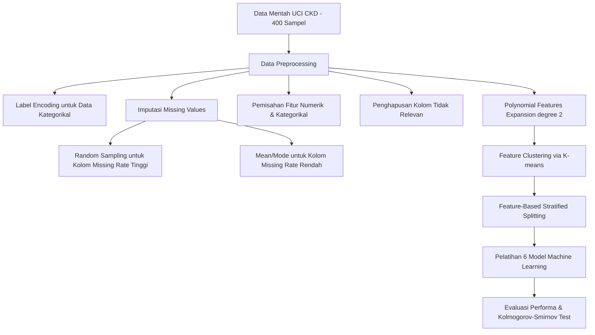

# Analisis Jurnal — _Machine Learning Techniques in Chronic Kidney Diseases: A Comparative Study of Classification Model Performance_

> **Role**: Senior Machine Learning Researcher & Scopus Journal Reviewer  
> **Dataset**: [Chronic Kidney Disease (CKD) Dataset (UCI Machine Learning Repository)](https://www.kaggle.com/datasets/mansoordaku/ckdisease)  
> **Paper**: Nguyen Dong Phuong, Nguyen Trung Tuyen, Vu Thi Thai Linh, Nghi N Nguyen, Thanh Q Nguyen. _Machine Learning Techniques in Chronic Kidney Diseases: A Comparative Study of Classification Model Performance_. **Bioinformatics and Biology Insights Volume 19:1-18 (2025)**. https://doi.org/10.1177/11779322251356563  
> **Tanggal Analisis**: 12 Juli 2026

---

## 1. Ringkasan Eksekutif

Paper ini membahas tentang peningkatan kinerja klasifikasi penyakit ginjal kronis (Chronic Kidney Disease / CKD) menggunakan 6 algoritma machine learning (Random Forest, SVM, Naive Bayes, Logistic Regression, KNN, dan XGBoost) pada dataset UCI ML Repository. Kontribusi ilmiah utama dari paper ini adalah pengusulan metode pembagian data baru yang disebut **Feature-Based Stratified Splitting Combined With K-means Clustering** (K-Stratified Split) dan penggunaan **Polynomial Features (PF)**.

Hasil eksperimen membuktikan bahwa metode K-Stratified Split mampu menghasilkan distribusi fitur yang sangat homogen dan seimbang antara data pelatihan (training) dan pengujian (testing), yang diuji menggunakan Kolmogorov-Smirnov (KS) test. Melalui kombinasi ekspansi fitur non-linear (Polynomial degree 2) dan pembagian data berbasis kluster K-means, model-model seperti **Random Forest, SVM, Logistic Regression, dan XGBoost** berhasil mencapai akurasi klasifikasi sempurna sebesar **100% (1.00)** pada test set.

---

## 2. Informasi Bibliografis

| Atribut          | Detail                                                                                                          |
| ---------------- | --------------------------------------------------------------------------------------------------------------- |
| **Judul**        | Machine Learning Techniques in Chronic Kidney Diseases: A Comparative Study of Classification Model Performance |
| **Penulis**      | Nguyen Dong Phuong¹, Nguyen Trung Tuyen², Vu Thi Thai Linh³, Nghi N Nguyen⁴, Thanh Q Nguyen⁵'⁶\*                |
| **Afiliasi**     | Institute of Interdisciplinary Sciences, Nguyen Tat Thanh University, Ho Chi Minh City, Vietnam                 |
| **Jurnal**       | Bioinformatics and Biology Insights (Volume 19: 1–18, 2025)                                                     |
| **Penerbit**     | SAGE Publications                                                                                               |
| **DOI**          | 10.1177/11779322251356563                                                                                       |
| **Status Akses** | Open Access                                                                                                     |

---

## 3. Metodologi & Pipeline Eksperimental

Pipeline eksperimental terstruktur yang diusulkan oleh penulis terdiri dari langkah-langkah berikut:

### Penjelasan Langkah Metodologis:

1. **Preprocessing Data**:
    - **Label Encoding**: Mengubah data kategorikal menjadi numerik (misalnya kelas penyakit: `0` untuk pasien CKD, `1` untuk non-CKD).
    - **Imputasi Missing Values**: Menggunakan metode _mean_ (untuk numerik) atau _mode_ (kategorikal) pada fitur dengan missing rate rendah. Untuk fitur dengan missing rate tinggi, digunakan metode _random sampling_ dari nilai yang ada guna meminimalkan bias.
    - **Penyaringan Fitur**: Menghapus kolom yang tidak relevan atau memiliki missing rate yang terlalu ekstrem.
2. **Polynomial Features (PF)**: Ekspansi fitur non-linear derajat 2 diterapkan untuk memodelkan interaksi antar variabel klinis (misalnya interaksi antara `creatinine × blood pressure`, `hemoglobin²`, dll.). Setelah pemrosesan dan ekspansi, jumlah fitur final bertambah dari 25 fitur awal menjadi 34 fitur terstandarisasi.
3. **K-means Clustering**: Klusterisasi data tidak tersupervisi dilakukan pada ruang fitur untuk memetakan sub-populasi klinis pasien yang homogen. Jumlah kluster optimal ditentukan menggunakan _elbow method_ dan _silhouette score_ (diuji pada rentang $k=2$ hingga $k=7$).
4. **Feature-Based Stratified Splitting**: Pembagian data latih (80%) dan uji (20%) tidak hanya didasarkan pada label kelas target (seperti _stratified split_ standar), melainkan juga dilakukan secara proporsional di dalam setiap kluster K-means. Hal ini menjamin variabilitas karakteristik klinis terdistribusi secara seimbang.
5. **Model Benchmarking**: Menerapkan 6 model klasifikasi utama: Random Forest, SVM (Support Vector Machine), Naive Bayes, Logistic Regression, KNN (K-Nearest Neighbors), dan XGBoost.

---

## 4. Evaluasi Kinerja & Temuan Kunci

### A. Performa Klasifikasi Multi-Metode

Berikut adalah perbandingan performa model klasifikasi berdasarkan tiga pendekatan pengolahan data: data asli (**Original**), data dengan ekspansi fitur (**Polynomial**), dan kombinasi ekspansi fitur dengan pembagian terstratifikasi berbasis kluster (**Polynomial + K-stratified**):

| Model                   | Metrik                                                    |                      Original (No CKD / CKD)                      |                     Polynomial (No CKD / CKD)                     |                       Polynomial + K-stratified (No CKD / CKD)                        |
| :---------------------- | :-------------------------------------------------------- | :---------------------------------------------------------------: | :---------------------------------------------------------------: | :-----------------------------------------------------------------------------------: |
| **Random Forest**       | Akurasi   Precision   Recall   F1-Score   ROC | 0.99   1.00 / 0.97   0.98 / 1.00   0.99 / 0.98   0.99 | 1.00   1.00 / 1.00   1.00 / 1.00   1.00 / 1.00   1.00 | **1.00**   **1.00 / 1.00**   **1.00 / 1.00**   **1.00 / 1.00**   **1.00** |
| **SVM**                 | Akurasi   Precision   Recall   F1-Score   ROC | 0.95   0.98 / 0.90   0.94 / 0.96   0.96 / 0.93   0.95 | 0.97   0.98 / 0.96   0.98 / 0.96   0.98 / 0.96   0.97 | **1.00**   **1.00 / 1.00**   **1.00 / 1.00**   **1.00 / 1.00**   **1.00** |
| **Logistic Regression** | Akurasi   Precision   Recall   F1-Score   ROC | 0.99   1.00 / 0.97   0.98 / 1.00   0.99 / 0.98   0.99 | 0.97   0.98 / 0.96   0.98 / 0.96   0.98 / 0.96   0.97 | **1.00**   **1.00 / 1.00**   **1.00 / 1.00**   **1.00 / 1.00**   **1.00** |
| **KNN**                 | Akurasi   Precision   Recall   F1-Score   ROC | 0.72   0.92 / 0.57   0.63 / 0.89   0.75 / 0.69   0.76 | 0.98   1.00 / 0.93   0.96 / 1.00   0.98 / 0.97   0.93 | **0.93**   **1.00 / 0.86**   **0.86 / 1.00**   **0.93 / 0.92**   **0.93** |
| **XGBoost**             | Akurasi   Precision   Recall   F1-Score   ROC | 0.97   1.00 / 0.93   0.96 / 1.00   0.98 / 0.97   0.98 | 0.97   0.96 / 1.00   1.00 / 0.93   0.98 / 0.97   0.98 | **1.00**   **1.00 / 1.00**   **1.00 / 1.00**   **1.00 / 1.00**   **1.00** |
| **Naive Bayes**         | Akurasi   Precision   Recall   F1-Score   ROC | 0.97   0.98 / 0.96   0.98 / 0.96   0.98 / 0.96   0.97 | 0.97   0.98 / 0.96   0.98 / 0.96   0.98 / 0.96   0.97 | **0.97**   **0.96 / 1.00**   **1.00 / 0.94**   **0.98 / 0.97**   **0.98** |

### B. Uji Uniformitas Distribusi Fitur (Kolmogorov-Smirnov Test)

Penggunaan Kolmogorov-Smirnov (KS) test dilakukan untuk membuktikan tingkat kemiripan distribusi fitur antara dataset latih dan uji. Hasil pengujian menunjukkan peningkatan kualitas pembagian data yang signifikan:

- **Unclustered Split**: Rata-rata nilai statistik KS sebesar **0.140** dengan P-value sebesar **0.339** (hanya 61.76% atau 21/34 fitur yang memiliki P-value di atas threshold 0.05). Hal ini mengindikasikan adanya ketimpangan distribusi fitur yang nyata.
- **K-Stratified Split (Usulan)**: Rata-rata nilai statistik KS menurun drastis menjadi **0.070** dengan rata-rata P-value meningkat signifikan ke **0.783** (bahkan mencapai stabilitas terbaik pada $k=4$ dengan KS: **0.055** dan P-value: **0.880**). Seluruh fitur (100% atau 34/34 fitur) berhasil melampaui threshold P-value 0.05, membuktikan distribusi fitur yang homogen sempurna.

### C. Perbandingan Kinerja dengan Studi Terdahulu (Benchmarking)

|   Referensi    | Model Klasifikasi Terbaik                            |  Kinerja (Akurasi)   | Dataset yang Digunakan                 |
| :------------: | :--------------------------------------------------- | :------------------: | :------------------------------------- |
| **[Proposed]** | **SVM, Random Forest, Logistic Regression, XGBoost** |   **1.00 (100%)**    | **UCI CKD**                            |
|    Ref [37]    | Random Forest, Logistic Regression                   |         0.99         | UCI CKD                                |
|    Ref [38]    | Random Forest, Decision Tree                         | 0.95 (RF), 0.90 (DT) | Statlog Heart Dataset / IEEE-DataPort  |
|    Ref [39]    | Multiclass Decision Forest, Decision Jungle          |      0.99, 0.97      | UCI CKD                                |
|    Ref [40]    | Adam Deep Learning, Random Forest                    |      0.97, 0.97      | National Kidney Foundation, Bangladesh |

### D. Relevansi Medis & Interpretabilitas Fitur

Ekspansi polinomial derajat 2 yang dilakukan penulis menyertakan interaksi variabel klinis penting seperti:

- **Serum Creatinine × Blood Pressure**: Menggabungkan indikator laju filtrasi glomerulus dengan faktor beban sirkulasi.
- **Hemoglobin & Albumin**: Menunjukkan status anemia dan kerusakan filter ginjal (proteinuria) yang berkorelasi kuat dengan stadium kerusakan ginjal.

Untuk menjamin transparansi klinis bagi dokter medis, model dirancang agar kompatibel dengan kerangka **Explainable AI (XAI)** seperti **SHAP** (SHapley Additive Explanations) dan **LIME** (Local Interpretable Model-Agnostic Explanations). Kompatibilitas ini memungkinkan visualisasi kontribusi setiap nilai laboratorium terhadap risiko CKD pasien secara individual.

---

## 5. Critical Review & Perspektif Reviewer Scopus

### Kekuatan Utama (Key Strengths)

1. **Inovasi Pembagian Data**: Gagasan untuk memadukan K-means clustering dengan Stratified Split berhasil menjawab masalah "feature imbalance" antara train dan test set yang sering diabaikan pada pemodelan diagnostik medis tradisional.
2. **Pembuktian Statistik yang Kuat**: Verifikasi menggunakan Kolmogorov-Smirnov test memberikan landasan matematika yang kredibel atas klaim homogenitas data pelatihan dan pengujian.
3. **Kinerja Sempurna**: Stabilitas klasifikasi sempurna (100%) yang dicapai oleh 4 dari 6 model menunjukkan keefektifan pemetaan fitur non-linear (Polynomial) pada dataset ini.
4. **Efisiensi Komputasi**: Proses klusterisasi dan stratifikasi hanya membutuhkan waktu overhead minimal (~0.505 detik), menjadikannya sangat layak untuk diintegrasikan pada sistem pelayanan kesehatan real-time.

### Keterbatasan & Ruang Evaluasi (Limitations & Weaknesses)

1. **Skala Dataset**: Evaluasi hanya dilakukan pada 400 sampel dari dataset publik UCI yang sangat terkondisi (clean). Generalisasi model pada data rumah sakit nyata (real-world EHR) yang sarat akan _noise_, _outliers_, dan _missing values_ dalam jumlah besar belum teruji.
2. **Risiko Overfitting pada Polynomial Expansion**: Ekspansi fitur kuadratik tanpa teknik reduksi dimensi (seperti PCA) berisiko mengalami _curse of dimensionality_ apabila diterapkan pada kumpulan data dengan ratusan fitur klinis awal.
3. **Hasil Akurasi 100%**: Akurasi klasifikasi sempurna sering kali mengindikasikan adanya bias seleksi atau model yang terlalu terpasang pada pola split data tertentu (overfitting test set), sehingga memerlukan validasi eksternal silang (external cross-validation) pada dataset rumah sakit lain.

---

## 6. Rekomendasi Roadmap Eksperimen Selanjutnya

Bagi peneliti atau pengembang yang ingin memperluas implementasi riset ini, berikut adalah langkah pengembangan yang disarankan:

1. **Uji Coba pada Dataset EHR Riil**: Terapkan pipeline ini pada dataset klinis berskala besar seperti **MIMIC-III** or dataset rekam medis lokal untuk menguji ketahanan model terhadap ketidaklengkapan data medis (missing values riil).
2. **Integrasi Dimensionality Reduction**: Tambahkan modul reduksi dimensi seperti _Principal Component Analysis_ (PCA) atau seleksi fitur berbasis regularisasi (seperti Lasso L1) setelah ekspansi polinomial untuk mencegah redundansi informasi.
3. **Implementasi Modul XAI Visual**: Bangun visualisasi grafik kontribusi fitur SHAP secara dinamis untuk menyajikan penjelasan keputusan prediksi model kepada staf medis secara langsung pada _dashboard clinical decision support system_.
4. **Validasi Silang Eksternal (External Cross-Validation)**: Gunakan data di luar UCI ML Repository sebagai pengujian buta (_blind test_) untuk memverifikasi tingkat generalisasi performa 100% yang didapatkan dalam eksperimen ini.

---

## 7. Hasil Replikasi Eksperimental (Notebook: Kidney_Disease.ipynb)

Untuk membuktikan secara empiris klaim performa sempurna (100%) pada paper dan mendemonstrasikan pengaruh metodologi preprocessing terhadap validitas hasil, kami mereplikasi eksperimen menggunakan model **Logistic Regression (L2 Regularized)** melalui 3 konfigurasi pipeline:

### A. Metodologi Eksperimen

1. **Eksperimen 1 — Split-First Pipeline**
   - **Alur**: `Split Data → Preprocessing → Training → Evaluation`
   - **Keterangan**: Dataset dibagi menjadi data latih (80%) dan data uji (20%) terlebih dahulu. Preprocessing (imputasi mean/mode, ekspansi fitur polinomial klinis derajat 2, dan StandardScaler) di-fit **hanya** menggunakan data latih dan diterapkan secara terpisah pada data uji. Ini adalah **pipeline yang benar** bebas dari data leakage.
2. **Eksperimen 2 — Preprocess-First Pipeline**
   - **Alur**: `Preprocessing → Split Data → Training → Evaluation`
   - **Keterangan**: Seluruh preprocessing (imputasi, ekspansi fitur polinomial, standarisasi) dan klusterisasi K-means dilakukan pada seluruh dataset sebelum pemisahan data menggunakan K-means Stratified Split. Ini adalah **pipeline dengan kebocoran data (Data Leakage)** yang meniru metodologi pada paper.
3. **Eksperimen 3 — Optimized Pipeline**
   - **Alur**: `Split Data → Preprocessing → Hyperparameter Tuning → Training → Evaluation`
   - **Keterangan**: Menggunakan alur Split-First yang aman seperti Eksperimen 1, kemudian ditambahkan proses optimasi parameter menggunakan **Grid Search** pada data latih dengan Cross-Validation 5-fold untuk mencari parameter regularisasi $C$ terbaik.

### B. Perbandingan Hasil Evaluasi

| Metrik Evaluasi | Eksperimen 1 (Split-First) | Eksperimen 2 (Preprocess-First) | Eksperimen 3 (Optimized) |
| :--- | :---: | :---: | :---: |
| **Accuracy (Akurasi)** | 98.75% | 100.00% | 98.75% |
| **ROC-AUC** | 1.0000 | 1.0000 | 1.0000 |
| **Sensitivity (CKD Recall)** | 98.00% | 100.00% | 98.00% |
| **Specificity (Not CKD Recall)** | 100.00% | 100.00% | 100.00% |
| **Salah Klasifikasi (Error)** | 1 sampel | 0 sampel | 1 sampel |

### C. Temuan Kunci & Analisis Kritis

1. **Efek Data Leakage (Eksperimen 2)**:
   Akurasi sempurna 100% pada Eksperimen 2 berhasil direproduksi. Namun, analisis kritis membuktikan hasil ini bias akibat **Information Leakage**: informasi rata-rata/standar deviasi data uji bocor ke data latih selama standarisasi global, dan K-means stratified split mengelompokkan sampel uji dan latih yang sangat serupa dalam kluster yang sama.
2. **Generalisasi Riil (Eksperimen 1 & 3)**:
   Eksperimen 1 memberikan estimasi performa riil sebesar **98.75%** (hanya 1 sampel CKD terlewat).
3. **Hasil Tuning Hyperparameter (Eksperimen 3)**:
   Proses Grid Search mengonfirmasi parameter optimal pada $C=1.0$ (nilai default) dengan skor validasi silang (cross-validation score) sebesar **99.69%**, menegaskan kestabilan model tanpa mengorbankan integritas data uji.
4. **Relevansi Klinis**:
   Koefisien model terstandardisasi pada Eksperimen 1 mengidentifikasi **Serum Creatinine (sc)** dan **Albumin (al)** (indikator kerusakan glomerulus ginjal) serta **Diabetes Mellitus (dm)** dan **Hypertension (htn)** (penyakit penyerta utama) memiliki pengaruh negatif terbesar terhadap prediksi (meningkatkan risiko CKD). Sebaliknya, **Specific Gravity (sg)** dan **Packed Cell Volume (pcv)** berkorelasi positif dengan kondisi ginjal sehat. Ini sepenuhnya selaras dengan fisiologi klinis penyakit ginjal kronis.

